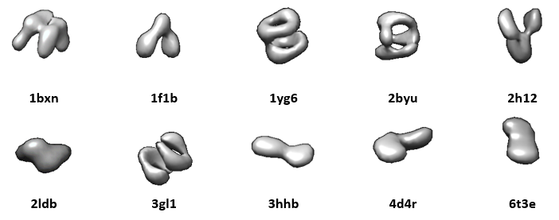
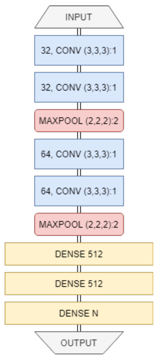
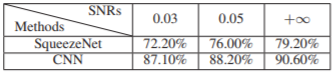

# CryoET-Simulation-Classification Experiment
## 3D Convolutional Neural Network based Classification Method:

This code repository has experimenation code and results published in the article ['Efficient Cryo-Electron Tomogram Simulation of Macromolecular Crowding with Application to SARS-CoV-2'. ](https://ieeexplore.ieee.org/abstract/document/9313185)

In order to validate that the simulation approach formulated in the paper can be used to assist cryo-ET analysis, we generated a dataset containing 15,000 samples, and used it to train and test two cryo-ET classification methods. This repository contains the code and results for the 'CNN based approach'.

### Dataset Used:
We derived the orginal data from the Protein Data Bank. We then used three simulated datasets of subtomograms of 32^3 voxels. Each dataset had different SNR levels. The SNRs used were 0.03, 0.05 and positive infinity respectively. In each set, we obtained 5000 subtomograms of 10 classes. The 10 types of macromolecules and an example of the corresponding simulated cryo-ET slice could be found in the following figure:

  

### 3D-CNN Model Architecture:

  

### Results:
The following table shows the results obtained from our experiments on the Cryo-ET data. The 3D CNN architecture shows better results in all three noise environments.

  

### Citation

@INPROCEEDINGS{9313185,
  author={Liu, Sinuo and Ma, Yan and Ban, Xiaojuan and Zeng, Xiangrui and Nallapareddy, Vamsi and Chaudhari, Ajinkya and Xu, Min},
  booktitle={2020 IEEE International Conference on Bioinformatics and Biomedicine (BIBM)}, 
  title={Efficient Cryo-Electron Tomogram Simulation of Macromolecular Crowding with Application to SARS-CoV-2}, 
  year={2020},
  volume={},
  number={},
  pages={80-87},
  doi={10.1109/BIBM49941.2020.9313185}}
  
### Usage

For ease of use, we conducted the experiments using Google Colab notebooks accelerated by the Tesla P100 GPU. There are three different notebooks, each used for training data of different SNR levels. 

To run a notebook,
1. Transform your data into a dataframe of x and y columns.
1. Convert the dataframe to pickle (.pkl) format.
2. Import the .pkl file into the colab notebook
3. Change the parameters about the input data in the file according to your input.
4. Run all the cells

### Published Work

Click [here](https://ieeexplore.ieee.org/abstract/document/9313185) to access the published research paper.
